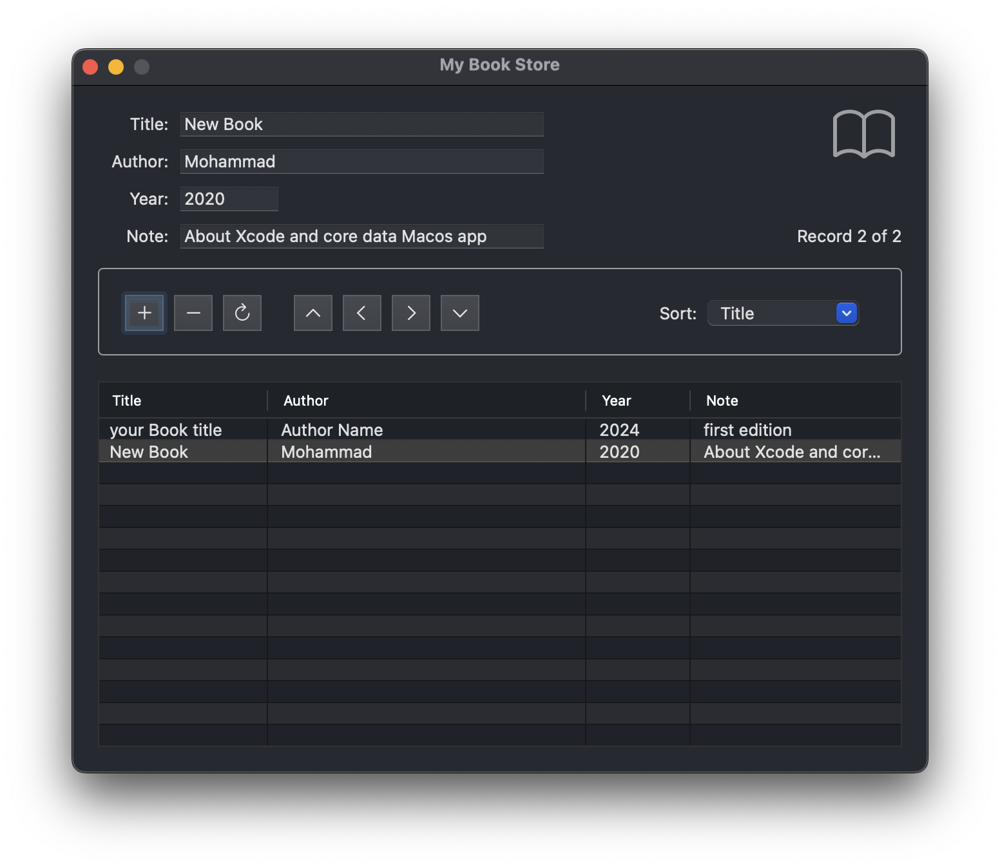

# Book Store App for macOS
## Core Data and Array Controller


A simple and powerful **Bookstore App** for macOS, built using Xcode with Storyboards and Core Data. This app allows users to manage a collection of books by storing details such as title, author, year, and notes. The app features full CRUD operations (Create, Read, Update, Delete), sorting, navigation, and dynamic UI updates.

---

## Features

- **CRUD Operations**: Add, remove, and modify book records.
- **Sorting**: Sort books by title, author, or year in ascending or descending order by clicking the table headers.
- **Navigation**: Navigate through records with "First", "Last", "Next", and "Previous" buttons.
- **Dynamic Label**: Displays the current record (e.g., "Record 2 of 5") and updates automatically with every action.
- **Core Data Integration**: Persistent storage of book data using Core Data.
- **Intuitive UI**: Simple interface with table view and text fields for easy data management.

---

## Screenshots

### Main Interface



---

## Getting Started

### Prerequisites

- **macOS**: Version 11.0 (Big Sur) or later.
- **Xcode**: Version 14.0 or later.
- **Swift**: Version 5.0 or later.

### Installation

1. Clone the repository:
   ```bash
   git clone : https://github.com/bodalal/BookStore
   cd bookstore-app

